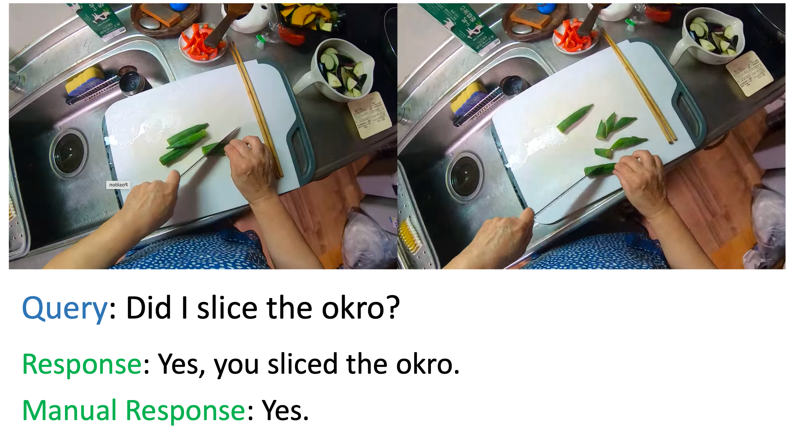

# Feature-Driven Natural Language Video Localization for Egocentric Video Queries

This project implements an extension for the Natural Language Queries (NLQ) benchmark in the [Ego4D](https://ego4d-data.org/docs/) dataset. Our work focuses on "From video interval to a textual answer," where we aim to extract textual answers from relevant video segments identified by NLQ methods. This approach leverages the combination of video localization techniques and video-language models to enhance the video question-answering pipeline.

## Table of Contents
1. [Project Overview](#project-overview)
2. [Installation](#installation)
3. [Dataset](#dataset)
4. [Training and Evaluation](#training-and-evaluation)
5. [Extension Implementation](#extension-implementation)
6. [Results and Scientific Report](#results-and-scientific-report)

## Project Overview

Egocentric vision captures daily life activities from a first-person viewpoint, presenting unique challenges for video understanding. In our project, we work on answering natural language queries about what happened in a video by:
1. Identifying the relevant segment within the video using the NLQ approach.
2. Extracting textual answers from these segments using a video-language model.

### Task Description
The NLQ task requires localizing temporal segments in videos where answers to natural language queries can be found. This project extends the standard NLQ by focusing on converting identified segments into textual answers, making it easier for users to understand the content of the video without watching it.

### Challenges Addressed
- Long and unstructured egocentric videos make it hard to directly extract answers.
- Video tokens are computationally expensive to process fully.
- Integrating multiple modalities (video and text) efficiently.

### Solution Approach
The solution involves:
1. Using Omnivore and EgoVLP features for model training.
2. Training VSLBase and VSLNet architectures for segment localization.
3. Implementing a two-step approach: first localizing the segment with VSLNet, then generating textual answers with a video-language model like Video-LLaVA.

## Installation

1. **Clone the Repository**  
   Clone the project repository and navigate to the project folder.
    ```bash
    git clone https://github.com/saghal/episodic-memory.git
    ```
2. **Install Dependencies**  
   Make sure you have Python 3.8 or higher. Install the required packages using the `requirements.txt` file.
    ```bash
    pip install requirements.txt
    ```

3. **Download Features and Annotations**  
   To work with the Ego4D dataset, you'll need to download the pre-extracted features and annotations. Follow these steps to set up the required data:

   - **Sign the License Agreement**  
     Before downloading the dataset, you need to sign the license agreement to access the Ego4D data. Follow the instructions [here](https://ego4d-data.org/docs/start-here/) to complete the license signing process.

   - **Download Pre-Extracted Features**  
     We use the Omnivore and EgoVLP features for this project. You can download the pre-extracted features from the following links:
     - [Omnivore Features](https://drive.google.com/file/d/1U318S34jw3uNnsURJ1T40YwsSuK5_-RJ/view?usp=share_link)
     - [EgoVLP Features](https://drive.google.com/file/d/1U318S34jw3uNnsURJ1T40YwsSuK5_-RJ/view?usp=share_link) 

   - **Download Annotations**  
     Download the NLQ annotations (version 1) needed for training and evaluation:
     - [Ego4D NLQ Annotations](https://ego4d-data.org/docs/annotations/)

   - **Organize the Downloaded Files**  
     Make sure to place the downloaded files in the appropriate directories within your project folder.

   - **Verify the Data Setup**  
     Ensure that the features and annotations are correctly placed in their respective directories.

## Dataset

The project utilizes the Ego4D dataset, which contains diverse first-person video recordings captured in natural, everyday settings. The dataset is specifically designed for understanding human actions, interactions, and visual experiences from an egocentric perspective.

### 1. Ego4D Dataset Overview

Ego4D is a large-scale dataset with the following key components:
- **Total Duration:** 3,670 hours of first-person video.
- **Video Sources:** Collected from 74 worldwide locations across 9 countries.
- **Scenarios:** Videos cover a variety of real-world scenarios, such as cooking, socializing, sports, and crafts.
- **Annotations:** Includes a range of annotations for tasks such as Natural Language Queries (NLQ), moment queries, episodic memory, and hand-object interactions.

For more information on the dataset, visit the [official Ego4D website](https://ego4d-data.org).

### 2. NLQ Annotations

The project specifically uses the Natural Language Query (NLQ) annotations:
- **NLQ Task:** This task involves predicting the start and end times of a video segment that best answers a natural language query.
- **Annotation Format:** The annotations are provided in JSON format and contain the video IDs, query text, and ground-truth temporal segment information.

### 3. Pre-Extracted Features

To facilitate experimentation, the project relies on pre-extracted features from the videos:
- **Omnivore Features:** These are visual features extracted using a pre-trained Omnivore model.
- **EgoVLP Features:** These features are obtained using the EgoVLP model, which is specifically trained for video-language pre-training tasks.

## Training and Evaluation

### Model Training

The training process is facilitated through Jupyter notebooks located in the `Notebooks` directory. Follow these steps to train and evaluate the models:

1. **Train VSLBase and VSLNet Architectures**  
   - Utilize the provided Google Colab notebooks for training VSLBase and VSLNet models. These models are designed for segment localization tasks.
   - Use Omnivore and EgoVLP features as visual representations to train the models effectively.
   - Follow the training instructions included within the notebooks for setting up and executing the training process.

### Evaluation Metrics

To assess the performance of the trained models, the following metrics are used:

- **Top-k Recall at Temporal Intersection over Union (tIoU) Thresholds**  
   Measures the ability of the model to correctly localize the relevant video segments. Top-k recall indicates the proportion of queries for which at least one of the top-k predicted segments overlaps with the ground truth above a specified tIoU threshold.

- **BLEU and ROUGE Scores**  
   These metrics are used to evaluate the quality of the generated textual answers, comparing them to reference answers based on n-gram overlap (BLEU) and sequence-level matching (ROUGE).

### Comparison with Baselines

Results are compared with baseline performances provided in the Ego4D paper:

- **Baseline Features:** SlowFast features used in the original Ego4D baseline experiments.
- **Performance Comparison:** Demonstrates improvements or shortcomings of the VSLBase and VSLNet models trained with Omnivore and EgoVLP features, in comparison to the SlowFast baseline.

The detailed training procedures, evaluation results, and comparison metrics can be explored using the notebooks in the `Notebooks` directory.

## Extension Implementation

### Overview

The extension aims to transform the localized video segments into textual answers by:

1. **Selecting 50 NLQ Queries:**  
   Choose 50 NLQ queries that have correctly retrieved segments for analysis.

2. **Annotating Textual Answers:**  
   Provide the correct textual answer for each selected query, stored in `Notebooks/clips_with_manual_responses.json`.

3. **Generating Answers:**  
   Utilize a video-language model to generate answers from the identified video segments.

### Steps

#### 1. Manual Annotation
- Manually annotate the selected 50 video segments with the correct textual answers. This involves reviewing the video segments retrieved for each query and writing concise, accurate answers.

#### 2. Segment Extraction
- Use **ffmpeg** to extract the relevant video segments identified during the localization phase. This allows for focused analysis on the specific parts of the video that are pertinent to the queries.

#### 3. Textual Answer Generation
- Apply a video-language model, such as **Video-LLaVA**, to generate textual answers from the extracted segments. This step involves feeding the extracted video segments into the model and retrieving the generated textual responses.

#### Comparison of Manual and Generated Answers
Below is an image that illustrates the manually annotated answers alongside the responses generated by the video-language model (VLM) for the extracted clips:



The implementation of these steps will allow for a comparative analysis between the manually annotated answers and those produced by the video-language model, enabling an evaluation of the model's effectiveness.

## Results and Scientific Report

The project demonstrates an improved capability to generate meaningful textual answers from localized video segments.

### Results Overview

- **Qualitative Analysis:**  
  Showcases sample questions and answers along with the corresponding video segments.

- **Quantitative Metrics:**  
  Evaluation of performance using BLEU and ROUGE scores.

### Scientific Report

The scientific report for this project provides a comprehensive explanation of the entire process, including:

- A literature review of egocentric vision and video understanding.
- An explanation of the Ego4D dataset and the NLQ benchmark.
- Technical details of the VSLBase and VSLNet architectures.
- Implementation details of the project extensions.
- Evaluation results with thorough analyses.

The report is available in both PDF and LaTeX formats in the `Report` directory. For an in-depth understanding, please refer to the scientific report, which explains all details in depth.

For additional project details, refer to the document located at `./ProjectDetails/Project_Details.pdf`.
